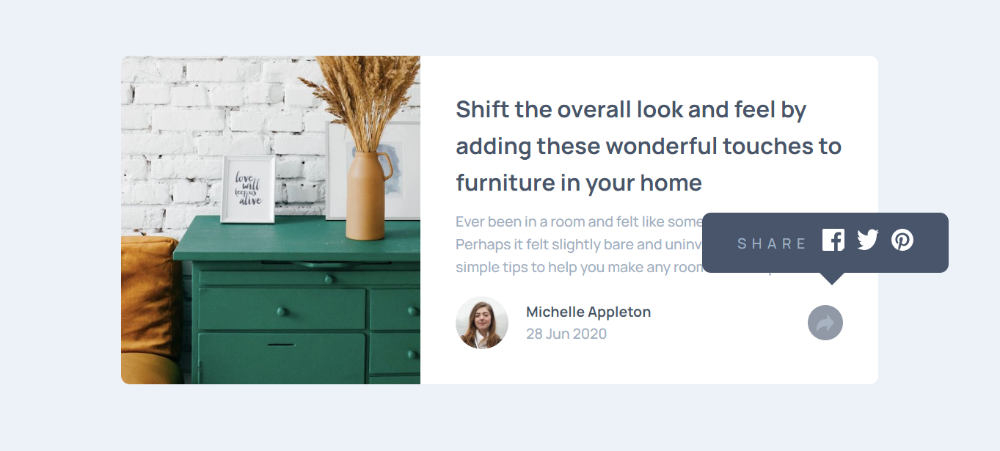

# Frontend Mentor - Article preview component solution

This is a solution to the [Article preview component challenge on Frontend Mentor](https://www.frontendmentor.io/learning-paths/javascript-fundamentals-oR7g6-mTZ-/steps/661911e42f40450f914602ba/challenge/start). Frontend Mentor challenges help you improve your coding skills by building realistic projects.

### The challenge

The challenge is to initiate the share options when the user clicks the share icon.

Users should be able to:

- See the social media share links when they click the share icon
- View the optimal layout for each page depending on their device's screen size
- See hover states for all interactive elements on the page

### Screenshot

### Links

- Solution URL: [Repository](https://github.com/SirTebz/Article-Preview-Component)
- Live Site URL: [Live Page](https://sirtebz.github.io/Article-Preview-Component/)

### Built with

- Semantic HTML5 markup
- CSS custom properties
- Flexbox
- JavaScript
